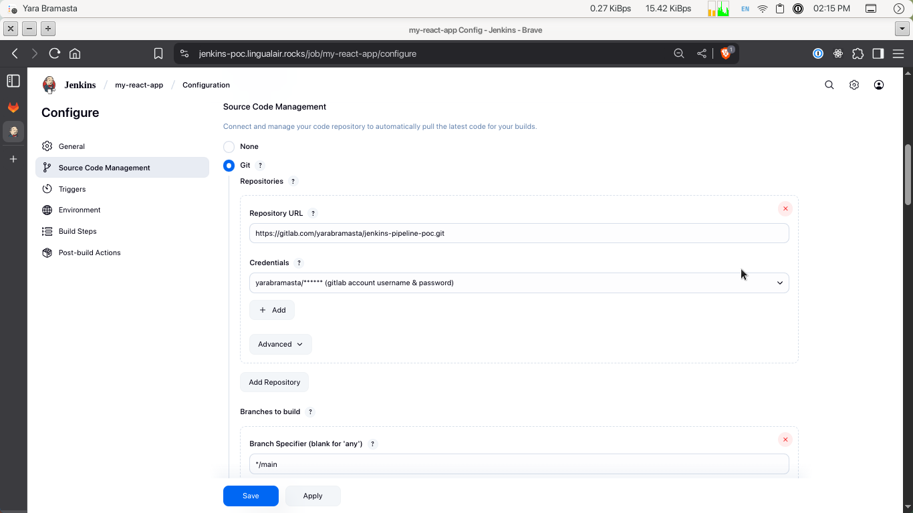
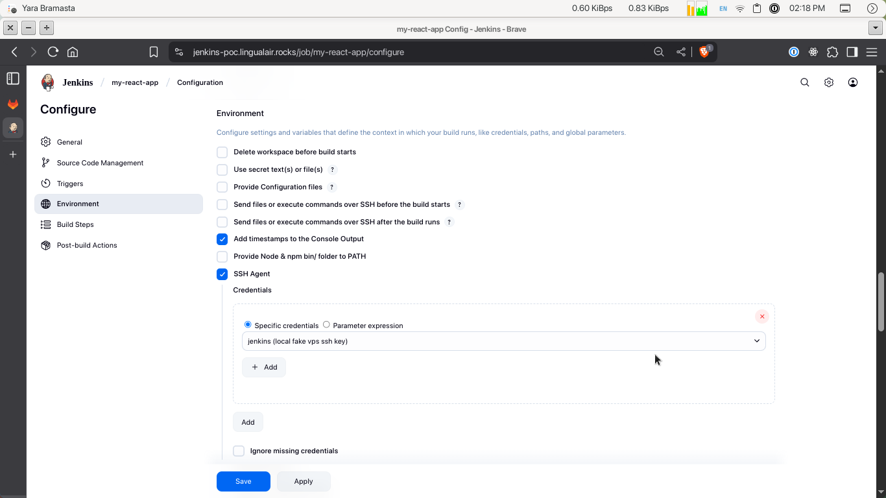

# Jenkins Pipeline Proof-of-Concept

Simple guide and demo, demonstrating how to setup Jenkins as CI/CD pipeline in a different environment, accessed through SSH for who don't wanna use docker registry.

Requirements:

- Docker engine latest version - https://docs.docker.com/engine/install/

- Jenkins via docker image - https://www.jenkins.io/doc/book/installing/docker/

- Docker network (can easily get started using docker compose)

## Sandbox Guide

This sandbox contains 3 docker container managed by docker compose.

First container named `jenkins-docker`, responsible to manage docker certs for Jenkins container. To simply summarize this container usage is docker:dind is Docker in Docker (it is to run Docker inside Docker as the name suggests).

Second container named `cicd-pipeline` will be responsible for managing jenkins server. Image used to create this container - https://hub.docker.com/r/jenkinsci/blueocean/.

Third container named `openssh-server` is the sandbox emulating VPS, later used on pipeline steps to ssh into it and run the continous delivery step from CI/CD. The app used for this can be find at `web` folder. Image used to create this container - https://hub.docker.com/r/linuxserver/openssh-server/.

Second container can be accessed through ssh using command:
```bash
# username: jenkins
# password: pipeline
ssh -p 2222 jenkins@localhost
```
All the requirements to enable the ssh server is handled by docker image by `lscr.io/linuxserver/openssh-server:latest`.

## Jenkins Installation Guide

The simplest way to run Jenkins is through docker compose file. You can take a look the configuration at compose.yaml section service.pipeline.

To get the initial password, you can check the docker logs by using this command:

```bash
docker tail --tail 1000 -f container_id
```


## Jenkins Setup

After successfully logged in, Jenkins will let you choose the plugins that will be used. First option is to use plugins used by communities or the default one, and the second option is let you choose your suitable plugins aka you must setup yourself. Plugins used for this setup are:

- Organization and Administration (all)
- Build Features
  - Build Timeout
  - Credentials Binding
  - SSH Agent
  - Timestamper
  - Workspace Cleanup
- Pipelines and Continuous Delivery
  - all except Pipeline: GitHub Groovy Libraries
- Source Code Management
  - Git
  - Git Parameter
  - GitHub
  - GitLab
- Distributed Builds
  - SSH Build Agents
- User Management And Security (optional, prefer defaults)
  - Matrix Authorization Strategy
  - PAM Authentication
  - LDAP
- Appearance (optional)
  - Dark Theme


Second step is to create first admin user like this:


We'll use `jenkins` for the username and `pipeline` for the password.

After creating the admin, jenkins will lead you to input the url used by jenkins later. It is safe to use format like this https://your-domain.com/jenkins/ for production. For local use we can access it as http://localhost:8080/ like the placeholder suggests.


If you see warning for java version, you can also use the latest official jenkins image that use jdk-21 as its base.


We will use GitLab repository for this guide. Before that, create the access token first by accessing this url https://gitlab.com/-/user_settings/personal_access_tokens. Add new access token and make sure to have **api** scope on check.


Next step is to go to **Manage Jenkins > System** and scroll until `GitLab` section and fill the requirements. For more information check this guide https://docs.gitlab.com/integration/jenkins/#configure-the-jenkins-server.

It will look like this if succeed:


For the project, go to your repository and proceed with this guide from Gitlab docs on how to do integration with Jenkins.


Before going to next setup, first we need to install Jenkins plugin called `Publish Over SSH`. **Manage Jenkins > Plugins > Installed Plugins** and search for `Publish Over SSH` plugin.

Now the setup is done, we can move to next step, setting up the CI/CD pipeline using git integration.

## CI/CD Setup

First step is to create New Item.

Based on GitLab guides, you can select either Pipeline or Freestyle option. We'll stick to the guide and choose Freestyle.


Next is to setup the pipeline. It should look like this:


> NB: Use credentials we are creating before for our GitLab account.

On this step, we configure which repository should be used for this pipeline. You can make setup like this or tryna experiment yourself.


> NB: Credentials used for this one is not the same as the Gitlab one, but it is for your git account, the simplest one will be username & password credential type. I am using username & ssh key to be more secure. The step is the same like in how to create Gitlab credential in the previous step, it's just using different type of credential.



For git repository, the triggers should be like this.


Next step, is to configure the environment, since it is will be deployed to vps, we need to create new credentials with type ssh username & private key like in git account step, but this time for your vps server.

